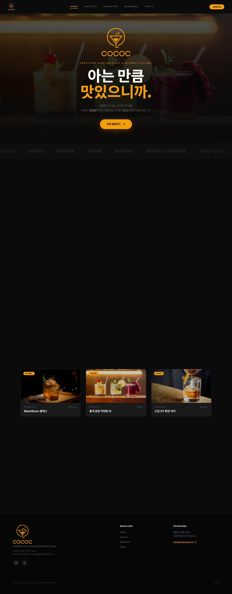
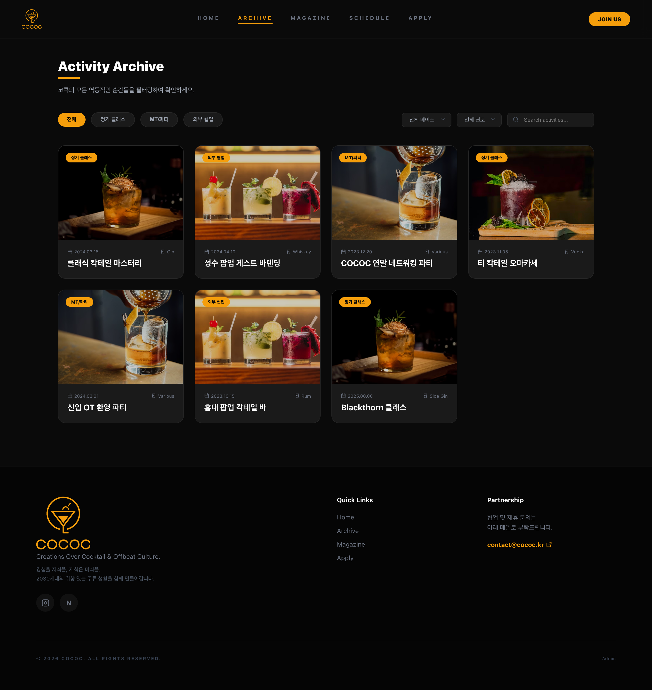
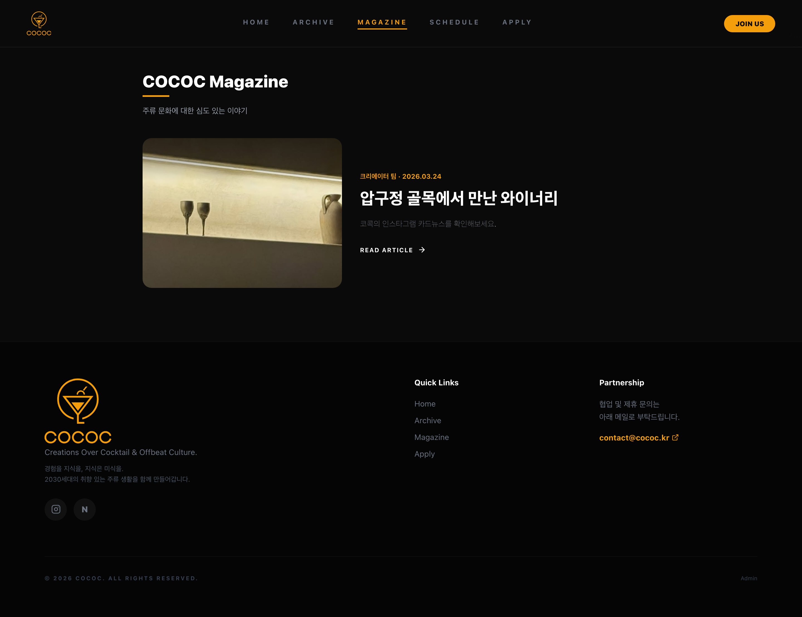
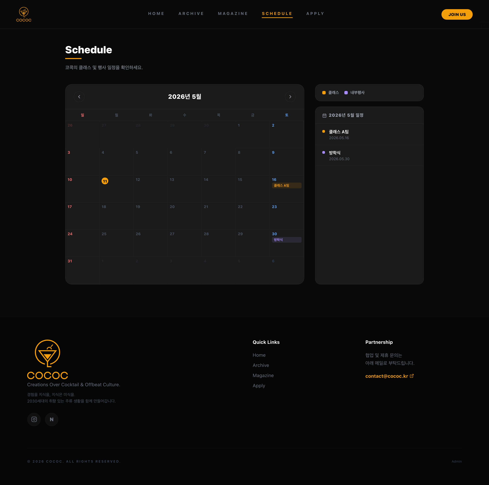
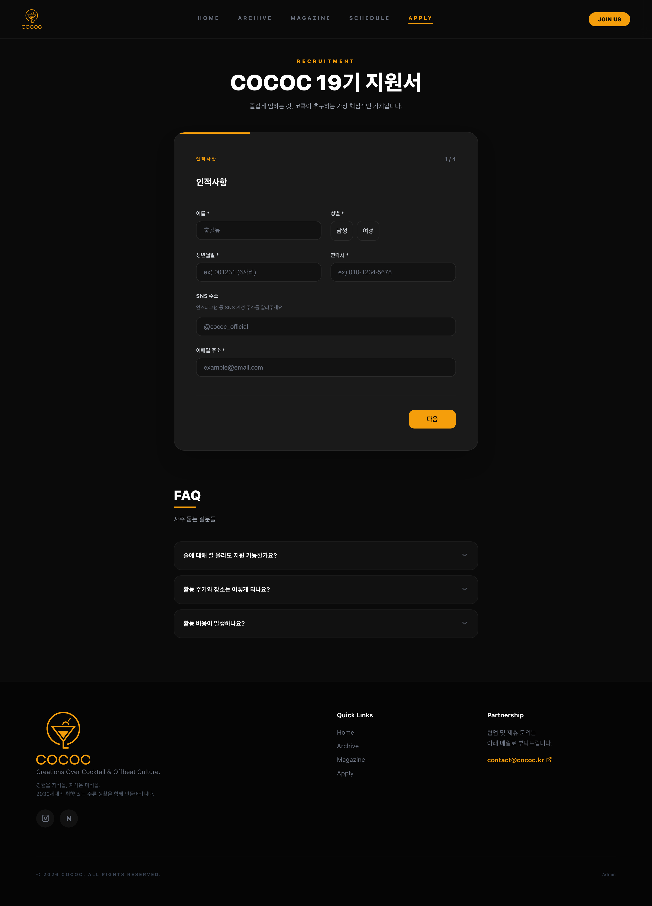
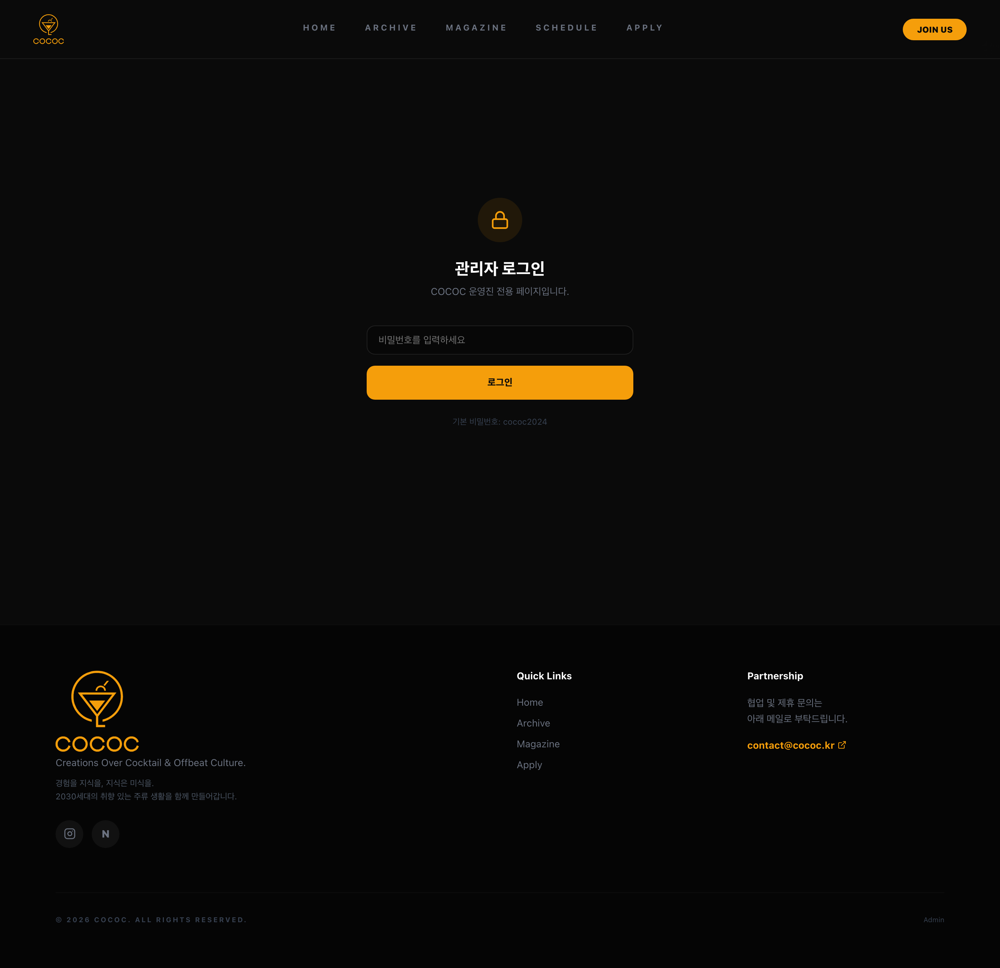

# COCOC

> **Creations Over Cocktail & Offbeat Culture**
> 대한민국 청년 주류 문화의 정점을 지향하는 동아리 COCOC 공식 웹사이트.

칵테일 클래스/행사 아카이브, 매거진, 스케줄, 지원서 접수, 어드민 관리 기능을 제공하는 풀스택 웹 애플리케이션입니다.

---

## 화면 미리보기

| 페이지 | 화면 |
|---|---|
| **홈** |  |
| **아카이브** |  |
| **매거진** |  |
| **스케줄** |  |
| **지원하기** |  |
| **어드민 로그인** |  |

> 스크린샷은 `docs/screenshots/` 아래에 보관되어 있으며, Playwright(`chromium`)로 1440×900 / DPR 2 풀페이지 캡처로 생성되었습니다.

---

## 기술 스택

### Frontend (`/`)
- **React 18** + **TypeScript**
- **Vite 5** — 개발 서버 / 빌드
- **TanStack Router** — 코드 기반 라우팅 (`src/routeTree.gen.tsx`)
- **TanStack Query** — 서버 상태 캐시
- **framer-motion** — 애니메이션
- **lucide-react** — 아이콘
- **overlay-kit** — 모달/오버레이
- CSS-in-JS — `src/lib/css.ts`, 토큰: `src/lib/tokens.ts`

### Backend (`/server`)
- **Express 4** + **TypeScript** (ESM, `tsx watch`)
- **Prisma 6** ORM + **SQLite** (`server/prisma/dev.db`)
- **multer** — 이미지 업로드 (`/uploads`)
- **cors**, **dotenv**
- 어드민 인증: **인메모리 토큰**(TTL 12h) — `POST /api/admin/login`

---

## 폴더 구조

```
cococ/
├── src/                       프론트엔드 (React)
│   ├── pages/                 라우트별 페이지
│   │   ├── home/  archive/  magazine/  schedule/  apply/  admin/
│   ├── domain/                서비스 레이어 (API 호출 추상화)
│   │   ├── apply/  archive/  magazine/
│   ├── components/            UI / 레이아웃 컴포넌트
│   ├── lib/
│   │   ├── api.ts             fetch 래퍼 (apiGet/Post/Put/Patch/Delete/UploadFile)
│   │   ├── upload.ts          업로드 헬퍼
│   │   ├── css.ts, tokens.ts  CSS-in-JS / 디자인 토큰
│   └── routeTree.gen.tsx      라우트 트리 (수동 관리)
│
├── server/                    백엔드 (Express)
│   ├── src/
│   │   ├── index.ts           서버 진입점 (PORT 4000)
│   │   ├── app.ts             Express 앱 설정 / 미들웨어 / 라우트 등록
│   │   ├── routes/            API 엔드포인트
│   │   │   ├── admin-auth.ts  로그인/로그아웃
│   │   │   ├── archive.ts     아카이브 CRUD
│   │   │   ├── magazine.ts    매거진 CRUD
│   │   │   ├── apply.ts       지원서 + 면접설정 + 지원기간
│   │   │   ├── schedule.ts    일정 CRUD
│   │   │   └── upload.ts      이미지 업로드
│   │   ├── middleware/        에러/인증 미들웨어
│   │   ├── prisma.ts          Prisma Client 인스턴스
│   │   └── seed.ts            초기 데이터
│   ├── prisma/
│   │   ├── schema.prisma      DB 스키마
│   │   ├── migrations/        마이그레이션 이력
│   │   └── dev.db             SQLite 파일 (자동 생성)
│   ├── uploads/               업로드된 이미지
│   └── BACKEND-GUIDE.md       백엔드 초보자용 상세 가이드
│
├── docs/screenshots/          README용 캡처
├── vite.config.ts             /api, /uploads → :4000 프록시
└── package.json               프론트 의존성
```

---

## 실행 방법

### 사전 요구사항
- **Node.js ≥ 18** (개발 환경은 v24에서 검증)
- **npm**

### 1. 프론트엔드 의존성 설치 (프로젝트 루트)
```bash
npm install
```

### 2. 백엔드 의존성 설치 + DB 초기화 + 시드
```bash
cd server
npm install
npx prisma migrate dev --name init   # DB 파일과 테이블 생성
npm run db:seed                      # 초기 데이터 삽입
```

### 3. 백엔드 실행 (터미널 1)
```bash
cd server
npm run dev
# ✅ COCOC 서버가 http://localhost:4000 에서 실행 중입니다
```

### 4. 프론트엔드 실행 (터미널 2, 루트에서)
```bash
npm run dev
# ➜ Local: http://localhost:5173
```

### 5. 브라우저 접속
- 프론트엔드: <http://localhost:5173>
- 백엔드 API: <http://localhost:4000/api>
- 어드민: <http://localhost:5173/admin> (비밀번호는 백엔드 `ADMIN_PASSWORD` 환경변수)

### 환경 변수
**`server/.env`**
```env
PORT=4000
DATABASE_URL="file:./dev.db"
ADMIN_PASSWORD=원하는_관리자_비밀번호
ALLOWED_ORIGINS=http://localhost:5173
```

**`.env.production` (프론트, 배포 시)**
```env
VITE_API_URL=https://your-backend-host
```

---

## 주요 NPM 스크립트

### 루트 (`package.json`)
| 명령 | 설명 |
|---|---|
| `npm run dev` | Vite 개발 서버 (5173) |
| `npm run build` | 프로덕션 빌드 (`dist/`) |
| `npm run preview` | 빌드 결과 로컬 미리보기 |

### 서버 (`server/package.json`)
| 명령 | 설명 |
|---|---|
| `npm run dev` | tsx 워치 모드 개발 서버 (4000) |
| `npm run build` | TypeScript 컴파일 |
| `npm start` | 빌드 결과 실행 |
| `npm run db:generate` | Prisma Client 생성 |
| `npm run db:migrate` | 마이그레이션 실행 |
| `npm run db:seed` | 시드 데이터 삽입 |
| `npm run db:reset` | DB 완전 초기화 후 재시드 |
| `npx prisma studio` | 브라우저로 DB GUI 열기 |

---

## API 개요

루트 인덱스: `GET /api`

| 도메인 | 베이스 경로 | 주요 메서드 |
|---|---|---|
| 어드민 인증 | `/api/admin` | `POST /login`, `POST /logout` |
| 아카이브 | `/api/archives` | `GET / · GET /:id · POST · PUT /:id · DELETE /:id` |
| 매거진 | `/api/magazines` | 위와 동일 패턴 |
| 지원서 | `/api/apply` | `GET/POST/PATCH/DELETE /applications`, `GET/PUT /interview-settings`, `GET/PUT /period`, `GET /is-open` |
| 스케줄 | `/api/schedules` | 아카이브 패턴 동일 |
| 업로드 | `/api/upload` | `POST` (multipart/form-data, 필드명 `file`) |

쓰기 계열 라우트는 `requireAdmin` 미들웨어로 보호되며, 로그인 시 발급된 32바이트 토큰(`Authorization: Bearer <token>`)을 12시간 동안 사용합니다.

자세한 백엔드 동작은 **[`server/BACKEND-GUIDE.md`](server/BACKEND-GUIDE.md)** 참고.

---

## 데이터 모델 요약

`server/prisma/schema.prisma` 기준 6개 테이블:

| 모델 | 용도 |
|---|---|
| `Archive` | 과거 행사/클래스 기록 (제목·연도·학기·베이스·태그·갤러리·레시피·본문 블록) |
| `Magazine` | 카드뉴스/아티클 |
| `Application` | 가입 지원서 (개인정보·일정·문항 응답·상태) |
| `Schedule` | 일정 (클래스/내부행사, 아카이브와 선택적으로 연결) |
| `InterviewSetting` | 면접 가능일·시간 슬롯 (단일 레코드) |
| `ApplyPeriod` | 지원 시작·종료·강제 마감 플래그 (단일 레코드) |

SQLite가 배열 타입을 지원하지 않으므로 `tags`, `gallery`, `recipes`, `content`, `availableTimes` 등은 JSON 문자열로 저장되고 응답 시 파싱됩니다.

---

## 스크린샷 재생성

캡처 스크립트는 저장소에 포함되어 있지 않지만, 다음 절차로 동일하게 재현할 수 있습니다.

```bash
# 1) 두 서버를 띄운다 (위 "실행 방법" 참고)
# 2) Playwright 준비
npx --yes playwright install chromium

# 3) 임시 스크립트로 캡처
node - <<'EOF'
import { chromium } from 'playwright';
const BASE = 'http://localhost:5173';
const OUT  = './docs/screenshots';
const pages = [
  ['01-home', '/'], ['02-archive', '/archive'], ['03-magazine', '/magazine'],
  ['04-schedule', '/schedule'], ['05-apply', '/apply'], ['06-admin-login', '/admin'],
];
const b = await chromium.launch();
const ctx = await b.newContext({ viewport:{width:1440,height:900}, deviceScaleFactor:2 });
const p = await ctx.newPage();
for (const [name, path] of pages) {
  await p.goto(BASE+path, { waitUntil:'networkidle' });
  await p.waitForTimeout(1000);
  await p.screenshot({ path: `${OUT}/${name}.png`, fullPage:true });
}
await b.close();
EOF
```

---

## 라이선스 / 기여

내부 동아리 프로젝트로, 라이선스는 별도로 명시되지 않았습니다. 기여 전에는 메인테이너에게 문의해 주세요.
